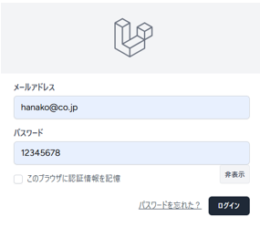
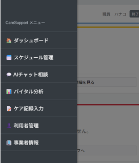
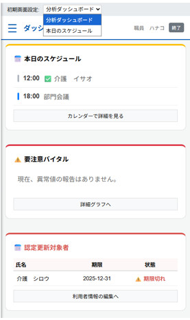
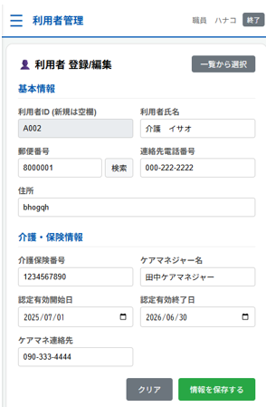
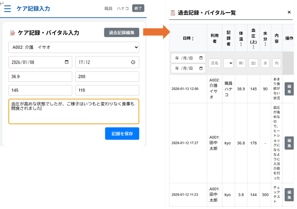
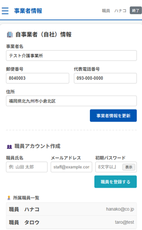
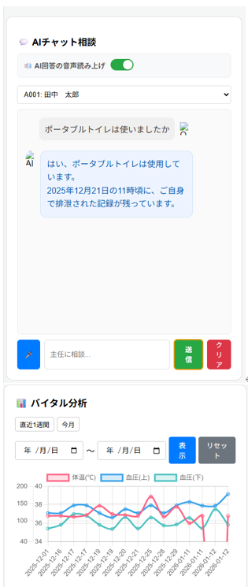
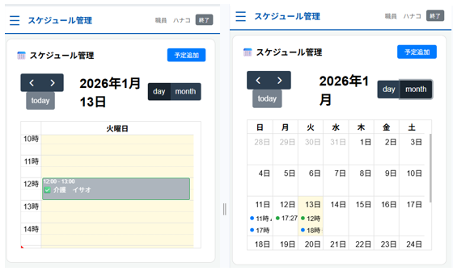

## 1.CareSupport AI
## https://careai.jp/login
(ログインユーザ/パスワード) hanako@co.jp / 12345678

(データベース添付) laravel_kadai08.sql

## 2.制作LPの説明（40文字程度）
事業企画「介護スタッフのサポートAI」についてスマホ対応を行いサイドメニューを追加した

さくらサーバにアップロードを行いスマホで動作確認

## (1)サイドメニュー

## (2)ダッシュボード
ログインしたときに「本日のスケジュール」or「分析ダッシュボード(お知らせ/AI/バイタル分析)」か選択できる

## (3)👤 利用者 登録/編集
新規利用者情報の登録、登録済の利用者の一覧表示・編集が可能

## (4)📝 ケア記録・バイタル入力
過去のケア記録の一覧表示、編集を可能とした

## (5)🏢 自事業者（自社）情報
ログインユーザ管理の為、事業所情報と所属職員(ユーザ/パスワード管理)ができるようにした

## (6)💬 AIチャット相談 📊 バイタル分析
対象利用者を選択・・・・上記(2)のケア記録のデータから質問に回答、回答に合わせてバイタルグラフを表示

対象利用者を未選択・・・一般的な回答を行う

チャットとは別に指定期間でバイタルグラフも表示可能とする

## (7)📅 スケジュール管理
利用者のケア予定、社内業務予定(会議等)のスケジュール管理ができる(ドラッグで日時変更可能)

上記(4)でケア記録が登録されていると✅が付く

## 3.工夫した点・こだわった点 
(1)ログインしたときに「本日のスケジュール」or「分析ダッシュボード」か選択できるようにした

(2)スケジュール機能を追加してドラッグでスケジュールを動かせるようにした

(3)スケジュールの予定に対してケア記録が登録できるようにした

(4)ケア記録が登録済のスケジュールには✅がつくようにした

(5)利用者情報の利用者IDの編集不可、必須入力バリデーションチェックを入れた

## 4.次回トライしたこと（または機能）
・イメージ画像を決めてリンクを正しく設定する

・スケジュール機能の実装/本日の予定機能の実装【済】

・GoogleMapとの連携で利用者住所の経路確認を可能とする

・AIの音声読み上げの改善

・画面構成/メニュー表示の改善【済】

・ケア記録の過去記録参照のページネーション

・各所にバリデーションチェックつける

・ケア記録の過去記録編集のモーダルの列幅見直し、正しく動作しない箇所の修正

・メッセージ(形と文)の改善

・スケジュール管理の文字サイズ調整、初回表示不具合修正

・サイドメニューの見直し

## 5.備考（感想、シェアしたいこと等なんでも） 
先週の講義を参考にメニュー(役割)ごとのphp、jsの管理ができるように分割しました。php、jsを分割したことで動作しなくなった箇所が複数出てきて、分割前と同じ動作にするのに時間がかかりました・・・が、分割することでそれぞれのコード管理がしやすくなりました。
