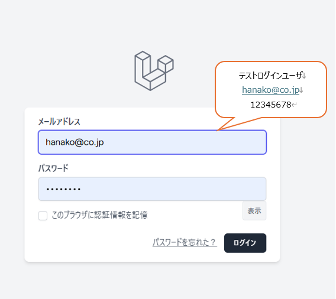
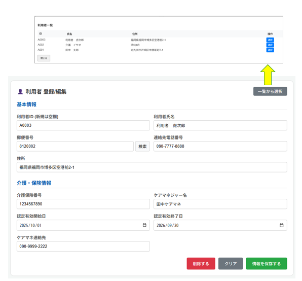
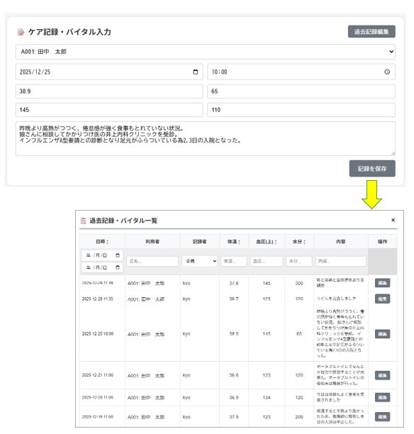
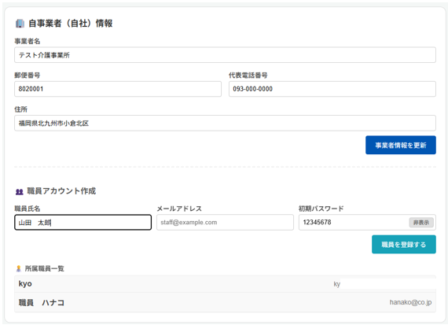
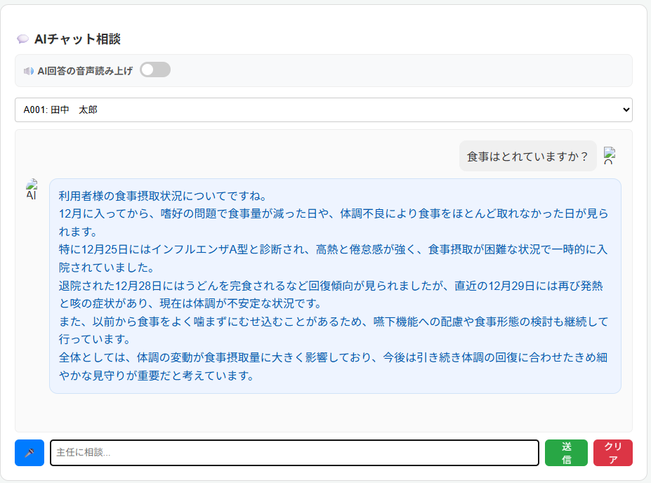
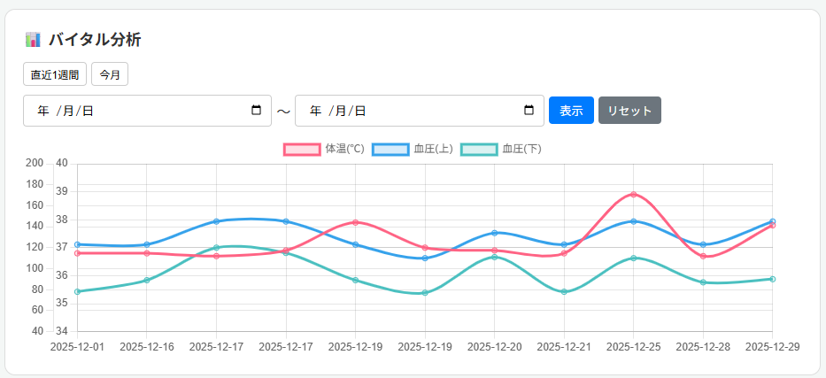

## 1.CareSupport AI
## https://careai.jp/login
(ログインユーザ/パスワード) hanako@co.jp / 12345678

(データベース添付) laravel.sql

## 2.制作LPの説明（40文字程度）
Laravel sail環境の移行に挑戦してみた。

さくらサーバにアップロードを行い動作を確認。

## (1)👤 利用者 登録/編集
新規利用者情報の登録、登録済の利用者の一覧表示・編集を可能とした

## (2)📝 ケア記録・バイタル入力
過去のケア記録の一覧表示、編集を可能とした

## (3)🏢 自事業者（自社）情報
ログインユーザ管理の為、事業所情報と所属職員(ユーザ/パスワード管理)ができるようにした

## (4)💬 AIチャット相談
対象利用者を選択・・・・上記(2)のケア記録のデータから質問に回答

対象利用者を未選択・・・一般的な回答を行う

## (5)📊 バイタル分析
上記(4)の回答に合わせてバイタルグラフを表示する

チャットとは別に指定期間でバイタルグラフも表示可能とする

## 3.工夫した点・こだわった点 
(1)郵便番号で住所登録を可能とした。登録済利用者一覧モーダルを表示できようにした。

(2)過去のケア記録一覧モーダルを表示して、フィルタを付けた。

(3)職員(ログインユーザ)を登録可能として、自事業者情報のIDと紐づくようにした。パスワードを表示確認できるようにした。

(4)AIの音声回答スイッチを設けてON/OFFを選択可能とした

(5)バイタル分析期間に「直近1週間」「今月」ボタンをつけた

## 4.次回トライしたこと（または機能）
・イメージ画像を決めてリンクを正しく設定する

・スケジュール機能の実装/本日の予定機能の実装

・GoogleMapとの連携で利用者住所の経路確認を可能とする

・AIの音声読み上げの改善

・画面構成/メニュー表示の改善

・ケア記録のページネーション

・各所にバリデーションチェックつける

## 5.備考（感想、シェアしたいこと等なんでも） 
Dockerが(PHP8.4)なのに対し、さくらサーバは現在(PHP8.3)までだったので、

アップロード後にページが表示されず色々と調べました。

アップロードを完了した後にページが表示された時は嬉しかったです

